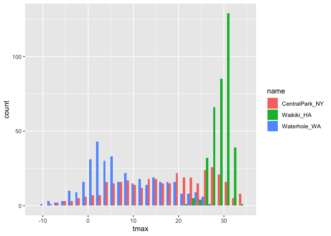
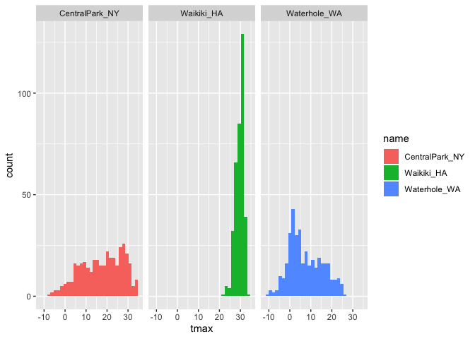

`ggplot` 1
================
Ashley Tseng
9/26/2019

Note that `ggplot2` is automatically loaded once we load the tidyverse.
`ggridges` won’t override any of the packages we have already loaded.

## Load dataset

``` r
weather_df = 
  rnoaa::meteo_pull_monitors(c("USW00094728", "USC00519397", "USS0023B17S"),
                      var = c("PRCP", "TMIN", "TMAX"), 
                      date_min = "2017-01-01",
                      date_max = "2017-12-31") %>%
  mutate(
    name = recode(id, USW00094728 = "CentralPark_NY", 
                      USC00519397 = "Waikiki_HA",
                      USS0023B17S = "Waterhole_WA"),
    tmin = tmin / 10,
    tmax = tmax / 10) %>%
  select(name, id, everything())
```

    ## Registered S3 method overwritten by 'crul':
    ##   method                 from
    ##   as.character.form_file httr

    ## Registered S3 method overwritten by 'hoardr':
    ##   method           from
    ##   print.cache_info httr

    ## file path:          /Users/ashleytseng/Library/Caches/rnoaa/ghcnd/USW00094728.dly

    ## file last updated:  2019-09-26 10:24:58

    ## file min/max dates: 1869-01-01 / 2019-09-30

    ## file path:          /Users/ashleytseng/Library/Caches/rnoaa/ghcnd/USC00519397.dly

    ## file last updated:  2019-09-26 10:25:12

    ## file min/max dates: 1965-01-01 / 2019-09-30

    ## file path:          /Users/ashleytseng/Library/Caches/rnoaa/ghcnd/USS0023B17S.dly

    ## file last updated:  2019-09-26 10:25:16

    ## file min/max dates: 1999-09-01 / 2019-09-30

Inside the rNOAA package, there is a dataset that we want. This lets us
interact with the NOAA servers and tell them what monitors we want data
from. We will recode the IDs with
`mutate`.

## Create a ggplot with minimum temp on the x-axis and max temp on the y axis:

``` r
ggplot(weather_df, aes(x = tmin, y = tmax)) + 
  geom_point()
```

    ## Warning: Removed 15 rows containing missing values (geom_point).

<!-- --> We
have only defined the x and y axes, but not the geometry (what we’re
plotting).

Alternate way of making this plot (via piping):

``` r
weather_df %>% 
  ggplot(aes(x = tmin, y = tmax)) + 
  geom_point()
```

    ## Warning: Removed 15 rows containing missing values (geom_point).

<!-- -->
Anytime you write code you should start with the data, and then do this,
and then do this… Note that this doesn’t save the scatterplot.

Saving initial plots (prof. mostly doesn’t do this):

``` r
scatterplot = weather_df %>% 
  ggplot(aes(x = tmin, y = tmax)) + 
  geom_point()

scatterplot
```

    ## Warning: Removed 15 rows containing missing values (geom_point).

<!-- -->

Adding color:

``` r
weather_df %>% 
  ggplot(aes(x = tmin, y = tmax)) + 
  geom_point(aes(color = name, alpha = 0.4))
```

    ## Warning: Removed 15 rows containing missing values (geom_point).

<!-- --> alpha
adds transparency

Why do `aes` positions matter? First:

``` r
weather_df %>% 
  ggplot(aes(x = tmin, y = tmax)) + 
  geom_point(aes(color = name, alpha = 0.4)) +
  geom_smooth(se = FALSE)
```

    ## `geom_smooth()` using method = 'gam' and formula 'y ~ s(x, bs = "cs")'

    ## Warning: Removed 15 rows containing non-finite values (stat_smooth).

    ## Warning: Removed 15 rows containing missing values (geom_point).

<!-- --> First
in ggplot we defined x and y. Then we defined color in geom\_point, so
color matters ONLY inside geom\_point but not to geom\_smooth. So we see
only one line for geom\_point. If we had defined color in ggplot, it
would have applied to all geom\_’s after that.

vs.

Second:

``` r
weather_df %>% 
  ggplot(aes(x = tmin, y = tmax, color = name)) + 
  geom_point() +
  geom_smooth(se = FALSE)
```

    ## `geom_smooth()` using method = 'loess' and formula 'y ~ x'

    ## Warning: Removed 15 rows containing non-finite values (stat_smooth).

    ## Warning: Removed 15 rows containing missing values (geom_point).

<!-- --> Now
we defined the color in ggplot and there’s multiple smooth lines (one
for each location).

## Facet\!

``` r
weather_df %>% 
  ggplot(aes(x = tmin, y = tmax, color = name)) + 
  geom_point(aes(alpha = 0.4)) +
  geom_smooth(se = FALSE)  + 
  facet_grid(. ~ name)
```

    ## `geom_smooth()` using method = 'loess' and formula 'y ~ x'

    ## Warning: Removed 15 rows containing non-finite values (stat_smooth).

    ## Warning: Removed 15 rows containing missing values (geom_point).

<!-- -->
Adding `facet_grid` results in three separate scatterplots per location.
This is fine, but not interesting. We’ve only plotted tmax and tmin. We
would assume that as tmin increases, that tmax would increase too.

``` r
ggplot(weather_df, aes(x = date, y = tmax, color = name)) + 
  geom_point(aes(size = prcp), alpha = 0.3) +
  geom_smooth(se = FALSE, alpha = 0.5) + 
  facet_grid(. ~ name)
```

    ## `geom_smooth()` using method = 'loess' and formula 'y ~ x'

    ## Warning: Removed 3 rows containing non-finite values (stat_smooth).

    ## Warning: Removed 3 rows containing missing values (geom_point).

<!-- --> We
see that there’s not much of a difference for Waikiki around the year.

# Some extra stuff

``` r
weather_df %>% 
  ggplot(aes(x = date, y = tmax, color = name)) +
  geom_smooth(se = FALSE, alpha = 0.5)
```

    ## `geom_smooth()` using method = 'loess' and formula 'y ~ x'

    ## Warning: Removed 3 rows containing non-finite values (stat_smooth).

<!-- --> You
don’t have to have ALL the geoms every time (the geoms that you pick are
up to you). Pick what’s useful to you.

2d density

``` r
weather_df %>% 
  ggplot(aes(x = tmin, y = tmax)) +
  geom_hex()
```

    ## Warning: Removed 15 rows containing non-finite values (stat_binhex).

<!-- -->

## More kinds of plots\!\!

Univariate plots:

``` r
weather_df %>% 
  ggplot(aes(x = tmax, fill = name)) +
  geom_histogram(position = "dodge")
```

    ## `stat_bin()` using `bins = 30`. Pick better value with `binwidth`.

    ## Warning: Removed 3 rows containing non-finite values (stat_bin).

<!-- -->
Histogram: gives me some idea of distribution Histogram has two types of
aes preferences. One is the outline of the bars (color), one is fill (f)
Don’t need to define a y-axis for histograms.

3 separate histograms:

``` r
weather_df %>% 
  ggplot(aes(x = tmax, fill = name)) +
  geom_histogram() +
  facet_grid(. ~ name)
```

    ## `stat_bin()` using `bins = 30`. Pick better value with `binwidth`.

    ## Warning: Removed 3 rows containing non-finite values (stat_bin).

<!-- -->

Density plots:

``` r
weather_df %>% 
  ggplot(aes(x = tmax, fill = name)) +
  geom_density(alpha = 0.3)
```

    ## Warning: Removed 3 rows containing non-finite values (stat_density).

<!-- --> Can
make comparisons across locations more easily. Prof’s favorite of the
histograms.

Box plots:

``` r
weather_df %>% 
  ggplot(aes(x = name, y = tmax)) + 
  geom_boxplot()
```

    ## Warning: Removed 3 rows containing non-finite values (stat_boxplot).

<!-- --> For
each distribution, we are getting an individual box plot per location.

Violin plots (not preferrable or particularly useful):

``` r
weather_df %>% 
  ggplot(aes(x = name, y = tmax)) + 
  geom_violin()
```

    ## Warning: Removed 3 rows containing non-finite values (stat_ydensity).

<!-- -->

``` r
weather_df %>% 
  ggplot(aes(x = name, y = tmax)) + 
  geom_violin(aes(fill = name), color = "blue", alpha = .5) + 
  stat_summary(fun.y = median, geom = "point", color = "blue", size = 4)
```

    ## Warning: Removed 3 rows containing non-finite values (stat_ydensity).

    ## Warning: Removed 3 rows containing non-finite values (stat_summary).

<!-- -->
Violin plots could be useful to see if a particular group was bimodal.

Ridge plots:

``` r
weather_df %>% 
  ggplot(aes(x = tmax, y = name)) + 
  geom_density_ridges(scale = .85)
```

    ## Picking joint bandwidth of 1.84

    ## Warning: Removed 3 rows containing non-finite values (stat_density_ridges).

<!-- --> What
do we see? We saw in geom\_density that these densities were stacked on
top of one another. Ridge plots show us the densities per location.

## Saving plots

``` r
weather_plot = ggplot(weather_df, aes(x = tmin, y = tmax)) + 
  geom_point(aes(color = name), alpha = .5) 

ggsave("weather_plot.pdf", weather_plot, width = 8, height = 5)
```

    ## Warning: Removed 15 rows containing missing values (geom_point).

DON’T use the built-in “Export” button\! If you do, your figure is not
reproducible – no one will know how your plot was exported. Instead, use
ggsave(). You should name and save your plot before exporting because by
default, ggplot will export your latest plot.

## Embedding plots in R Markdown with fig.width

``` r
weather_df %>% 
  ggplot(aes(x = tmin, y = tmax)) + 
  geom_point(aes(color = name, alpha = 0.4)) +
  geom_smooth(se = FALSE)
```

    ## `geom_smooth()` using method = 'gam' and formula 'y ~ s(x, bs = "cs")'

    ## Warning: Removed 15 rows containing non-finite values (stat_smooth).

    ## Warning: Removed 15 rows containing missing values (geom_point).

<!-- -->
Being compressed in the R window

``` r
weather_df %>% 
  ggplot(aes(x = tmin, y = tmax)) + 
  geom_point(aes(color = name, alpha = 0.4)) +
  geom_smooth(se = FALSE)
```

    ## `geom_smooth()` using method = 'gam' and formula 'y ~ s(x, bs = "cs")'

    ## Warning: Removed 15 rows containing non-finite values (stat_smooth).

    ## Warning: Removed 15 rows containing missing values (geom_point).

<!-- --> Now
is being stretched in the R window Be careful how your plots are
actually displayed
